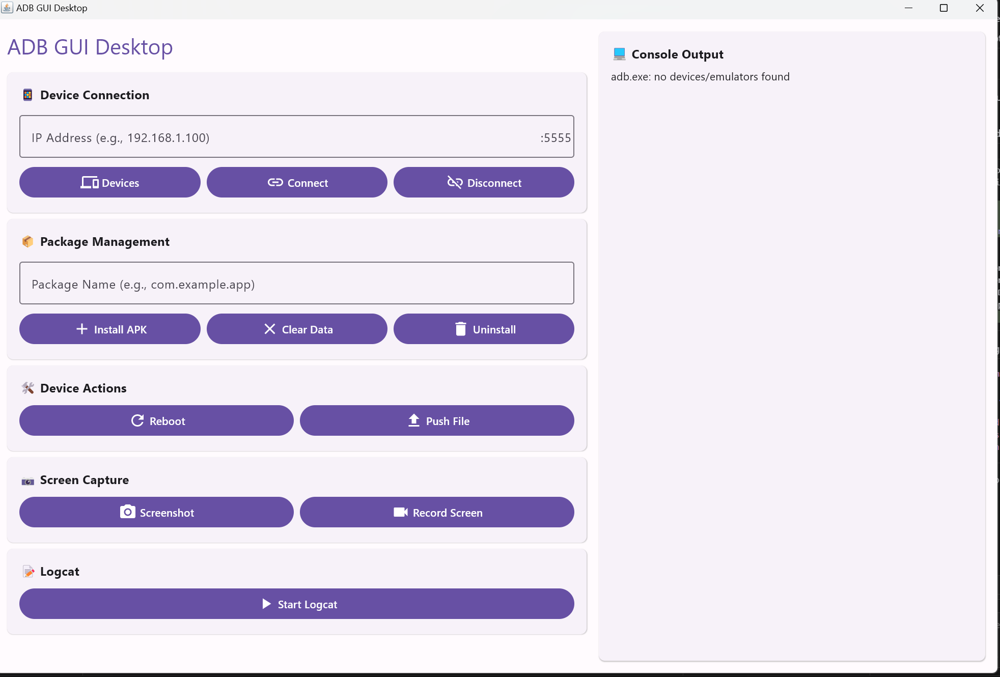

# ADB GUI Desktop
A modern Kotlin Multiplatform Desktop client for ADB commands, reimagined from the original Python adbGUI project.

## Features
1. ✅ ADB connect/disconnect
2. ✅ ADB devices list
3. ✅ ADB clear data
4. ✅ ADB reboot device
5. 🚧 ADB screenshot
6. 🚧 ADB screen record
7. 🚧 ADB install/uninstall
8. 🚧 ADB push file

## Screenshot

## Setup Requirements
1. Android SDK Platform Tools (ADB) must be installed and in your system PATH
2. JDK 11 or higher

## Development Setup
1. Clone the repository
2. Open in IntelliJ IDEA or Android Studio
3. Run the desktop application: 